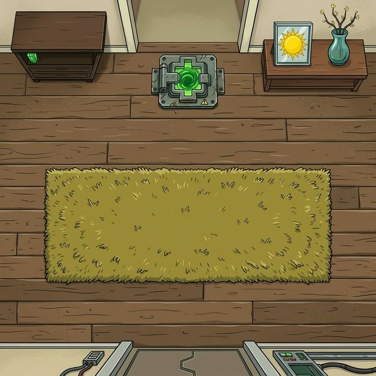

# Rick and Morty: Parasite Protocol 🔫

A browser-based action survive game where Morty must survive the Smith house overrun by memory parasites. Inspired by the **"Total Rickall"** episode.



## 🚀 Overview

This project is a modernized version of a legacy procedural Javascript game. It has been completely rebuilt from the ground up to feature an **Object-Oriented Architecture (ES6 Classes)**, a **Delta Time Game Loop** for smooth rendering across all monitors, and **Vite** for fast, module-based development.

### ✨ Features
* **Modern ES6 Architecture:** Clean separation of concerns with isolated classes for `Player`, `Enemy`, `Projectile`, and `Game` state management.
* **Delta Time Loop:** The `requestAnimationFrame` mechanics calculate frame differences to ensure smooth entity movements regardless of screen refresh rates.
* **Premium UI Engine:** A modernized glassmorphic HTML/CSS user-interface spanning over the classic Canvas drawing context.
* **Particle System:** Integrated visual feedback elements such as hit sparks and death explosions.
* **Utility Management:** Custom `InputManager` and `AssetLoader` classes seamlessly handle keystrokes and Media fetching asynchronously.

## 🛠️ Technologies
- **HTML5 Canvas API**
- **Vanilla Javascript (ES6 Modules)**
- **CSS3 (Custom Fonts, Neon Aesthetics, Glassmorphism)**
- **Vite** (Next Generation Frontend Tooling)

## 🎮 Controls
* **Arrow Up:** Move character up
* **Arrow Down:** Move character down
* **Spacebar:** Fire weapon

## 📦 How to Run

1. Clone or download this repository.
2. Install the necessary Node.js dependencies:
```bash
npm install
```
3. Start the Vite development server:
```bash
npm run dev
```
4. Open the provided `localhost` URL in your browser to play!

## 🏗️ Build for Production
To bundle the game for production mapping:
```bash
npm run build
```
The compiled files will be located automatically in the `/dist` pipeline directory.

---
*Wubba Lubba Dub Dub!*
